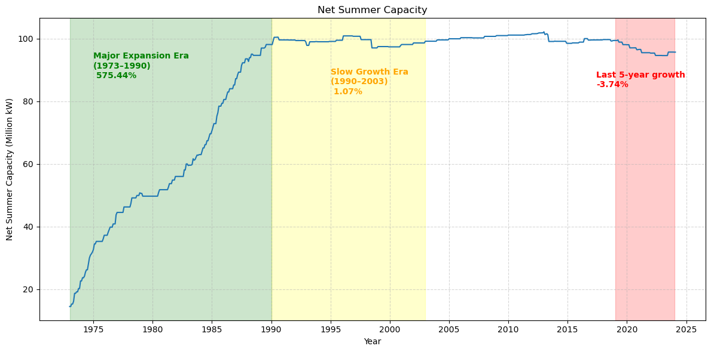
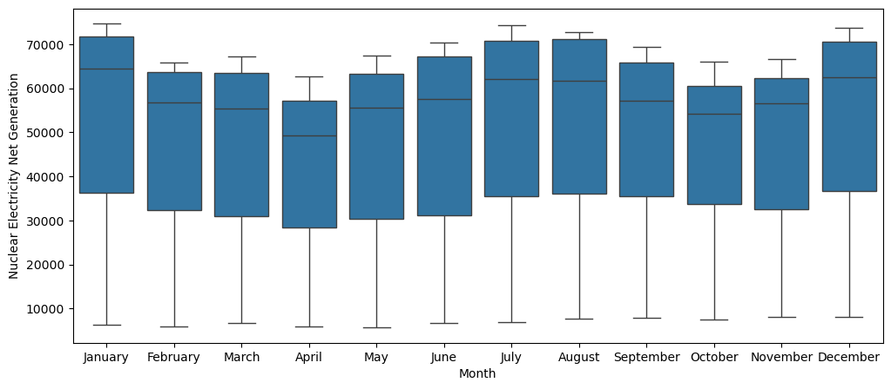
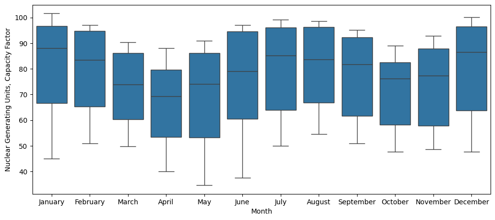

# Nuclear Energy Overview Dataset Analytics Project
## Project Overview
Nuclear energy is one of the most reliable and cleanest source of energy that plays a big role in energy transition and climate change mitigation. Public perception, policy decisions, and operational constraints may contribute to the dynamics of its utilization over time despite of its capability to have high capacity factor, means that nuclear energy having a high ratio of actual electricity generated to the maximum possible electricity the plant could have produced if it had operated at full power continuously. This project analyzes this data in order to expose trends and other insights in the nuclear energy sector.

## Tools Used
**1. Python:** Pandas, Matplotlib, Seaborn, Data Wrangler Extension for VS Code

## Dataset Source
**Kaggle**:	[Nuclear Energy Datasets](https://www.kaggle.com/datasets/alistairking/nuclear-energy-datasets)
### Data Structure (The description's copied from the Kaggle ReadME file)
| Column Name | Description | Datatype |
| --- | --- | --- |
| `Year` | The year for the data entry. | Integer |
| `Month` | The month for the data entry. | Object |
| `Nuclear Generating Units, Total Operable Units` | The total number of operable nuclear generating units (data not always available). | Object |
| `Nuclear Generating Units, Net Summer Capacity` | The net summer capacity of nuclear generating units in million kilowatts. | Float |
| `Nuclear Electricity Net Generation` | The net generation of electricity from nuclear power in millions of kilowatt-hours. | Integer |
| `Nuclear Share of Electricity Net Generation` | The percentage share of total electricity net generation coming from nuclear power. | Float |
| `Nuclear Generating Units, Capacity Factor` | The capacity factor (actual output vs potential output) of nuclear generating units. | Float |

## Data Cleaning
Removed the `Nuclear Generating Units, Total Operable Units` column because of too many missing data `Not Available`.

## Findings
### Data Statistics Summary
| index   |   Nuclear Generating Units, Net Summer Capacity |   Nuclear Electricity Net Generation |   Nuclear Share of Electricity Net Generation |   Nuclear Generating Units, Capacity Factor |
|---------|-------------------------------------------------|--------------------------------------|-----------------------------------------------|---------------------------------------------|
| count   |                                        614      |                                614   |                                     614       |                                    614      |
| mean    |                                         85.6071 |                              49806.5 |                                      17.2166  |                                     76.4963 |
| std     |                                         23.2862 |                              19647.1 |                                       4.17584 |                                     16.2811 |
| min     |                                         14.533  |                               5697   |                                       3.9     |                                     34.6    |
| 25%     |                                         78.7078 |                              31481.5 |                                      15.525   |                                     61.025  |
| 50%     |                                         98.533  |                              57362   |                                      18.8     |                                     79.15   |
| 75%     |                                         99.628  |                              65169.2 |                                      20.1     |                                     91.875  |
| max     |                                        102.206  |                              74649   |                                      22.9     |                                    101.6    |

### Correlation Heatmap

### Net Summer Capacity of Nuclear Energy
This timeseries data explain the maximum output of nuclear generating units during peak summer conditions. This data basically tells us **how much reliable generation** we can count on during **peak demand periods** (usually in summer). The line plot shows an overall increase in the net capacity of nuclear power, primarily during **the Major Expansion Era (1973–1990)** (highlighted in green), when the number of operating plants rose from 109 to 413. In the subsequent period from 1990 to 2003, there were **59 new plants commissioned and 50 plants shut down**, indicating a **slowdown in growth** caused by **the Three Mile Island (1979)** and **the Chernobyl Accident (1986)**. The most recent five-year data also shows a **decline in net capacity**, reflected by a **total annual growth rate of –3.74%** [[1](https://www.oecd.org/en/publications/forty-years-of-uranium-resources-production-and-demand-in-perspective_9789264028074-en.html)].

### Nuclear Electricity Net Generation

### Nuclear Share of Electricity and Nuclear Capacity Factor

### Seasonality Impact on Nuclear Electricity Net Generation and Capacity Factor

## References
[[1](https://www.oecd.org/en/publications/forty-years-of-uranium-resources-production-and-demand-in-perspective_9789264028074-en.html)] OECD Nuclear Energy Agency (NEA) & International Atomic Energy Agency (IAEA). Forty Years of Uranium Resources, Production and Demand in Perspective: The Red Book Retrospective. OECD Publishing, 2006.
